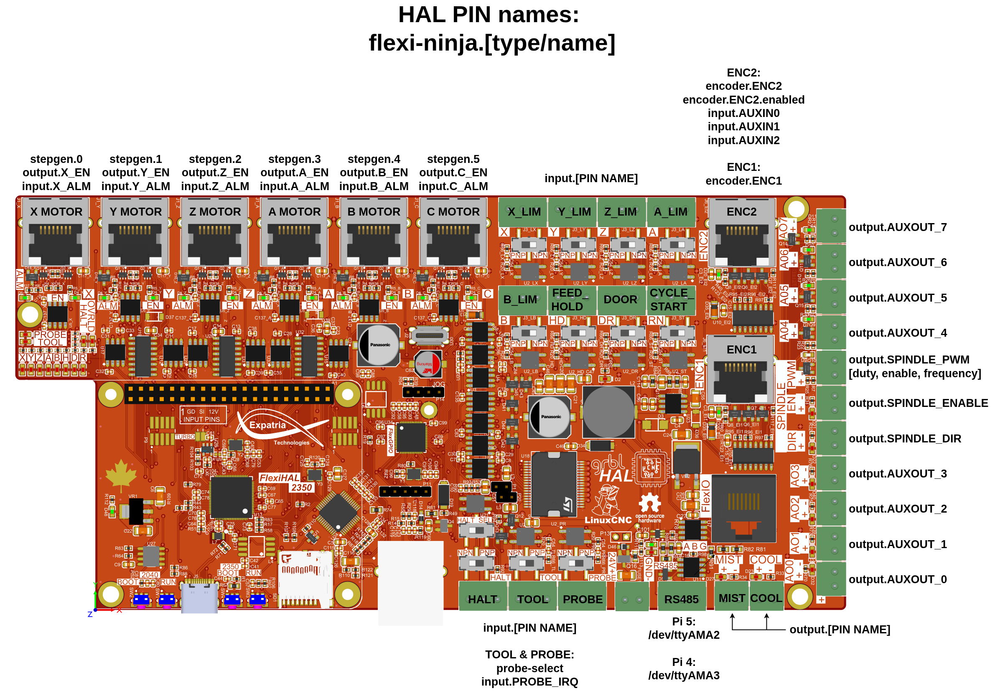

### Canadian-designed open source hardware. For everyone.

# Flexi-Ninja

Flexi-Ninja is a fork of [stepper-ninja](https://github.com/atrex66/stepper-ninja) for Expatria's hardware. Flexi-Ninja replaces the breakout board abstraction with a PlatformIO based build system and board definitions in `config.h`. 

Different in this fork from upstream stepper-ninja:
- Well-defined I/O with intuitive HAL pin names 
- PIO-based step generation with added position feedback to LinuxCNC for closed-loop tracking
- Configurable DIR pin setup time per axis via HAL pin to meet stepper driver timing requirements
- FlexGPIO I2C IO expander Used for alarm inputs, tool/probe sensors, axis enables, coolant, spindle, and auxiliary outputs
- Hybrid encoder handling: A high-speed PIO-based encoder (ENC1) and an IRQ-based encoder (ENC2). ENC2 can be disabled to free its pins as Aux inputs.
- All pin and module configuration in `config.h`

Using the SPI build of this firmware is recommended. To use this with LinuxCNC requires a Raspberry Pi 4 or 5 (Pi 5 strongly recommended). A pre-configured Pi image is available in the [Releases](https://github.com/Expatria-Technologies/Flexi-Pi/releases) section of the [Flexi-Pi](https://github.com/Expatria-Technologies/Flexi-Pi) repository, with setup notes for the Pi image in the [README](https://github.com/Expatria-Technologies/Flexi-Pi/blob/master/README.md) over there.

## Supported Boards

- [FlexiHAL 2350](https://github.com/Expatria-Technologies/FlexiHAL_2350) 

Note that FlexiHAL 2350 board rev A3.1 will require an interposer for the Pi header, which will be provided with your board. Boards newer than A3.1 will not require the interposer.

## Flashing

**Recommended**: Use the `flash_firmware` script to flash both MCUs on the board via the Pi header.

**Alternate**: USB drag-and-drop using the UF2 bootloaders in the RP2350 and RP2040. You will need to be sure you flash both the RP2350 that runs the main firmware and the RP2040 which is used for FlexGPIO. There are reaset and boot buttons for each MCU on the edge of the PCB near the USBC connector.


## Reference Config

A reference LinuxCNC configuration is included in [`config-samples/flexi-ninja/`](config-samples/flexi-ninja/). This is a QtDragon HD based configuration that will need editing for your specific machine.

- Edit `flexi-ninja.ini` for machine travels, limits, scale, DIR_SETUP, etc.
- Edit `flexi-ninja.hal` for VFD options (vfdmod or hy_vfd are included in the reference configutations) etc. 

## HAL Pin Structure

| Prefix | Pattern | Examples |
|--------|---------|----------|
| Inputs (GPIO) | `flexi-ninja.input.{NAME}` / `{NAME}-not` | `HALT`, `FEED_HOLD`, `X_LIM`, `AUXIN0-2` |
| Inputs | `flexi-ninja.input.{NAME}` / `{NAME}-not` | `X_ALM`, `Y_ALM`, `TOOL`, `PROBE` |
| Outputs | `flexi-ninja.output.{NAME}` | `X_EN`, `SPINDLE_ENABLE`, `MIST`, `AUXOUT_0-7` |
| Stepgen | `flexi-ninja.stepgen.{N}.{pin}` | `enable`, `command`, `feedback`, `dir-setup`, `debug-steps` |
| Encoder | `flexi-ninja.encoder.{NAME}.{pin}` | `position`, `velocity-rps`, `enabled`, `scale`, `filter-tau` |
| PWM | `flexi-ninja.SPINDLE_PWM.{pin}` | `value`, `enable`, `frequency` |

Every input pin has an inverted `-not` companion pin (e.g. `flexi-ninja.input.HALT-not`) to simplify HAL wiring. Use these if you need an inverted input rather than trying to invert it with separate components. 

## HAL Pinout
This diagram shows which HAL pins correspond to which connectors:



## Stepgens

**STEP pulse timing**: `flexi-ninja.stepgen.pulse-width` sets the STEP pulse width in nanoseconds. The default step time is 2500 ns (2.5 µs), which is supported by most common stepper drivers such as the DM542T. Step rates higher than 200kHz are possible by reducing the step times with drivers that support it. The maximum step rate is currently ~1Mhz, driven by a 1023 step per servo interval limit in the PIO stepgen.

**DIR setup timing**: `flexi-ninja.stepgen.{N}.dir-setup` sets the DIR pin lead time before the first STEP edge, in nanoseconds. It is configurable per per-axis, and the reference config includes this in the INI, `DIR_SETUP = 5000` for 5 µs.

## Encoders

- **ENC1**: High-speed PIO-based quadrature encoder. Tested to 500 kHz; will likely work at higher frequencies. Use this one as the primary encoder.
- **ENC2**: GPIO IRQ-based encoder. Tested to 50 kHz. ENC2 can be disabled via the `enc_enabled` HAL pin, When it is disabled with `(flexi-ninja.encoder.ENC2.enabled = 0`, the pins on the ENC2 connector are available as `AUXIN0/1/2` inputs for general use.

## Building Firmware

PlatformIO is used for the firmware build system, it is recommended to use the PlatformIO plugin in VScode. Two build environments are available:

| Environment | Communication | Command |
|-------------|--------------|---------|
| `flexi-2350_spi` | Direct SPI slave to Pi **(recommended)** | `pio run -e flexi-2350_spi` |
| `flexi-2350_w5500` | Ethernet via W5500  **(not yet complete)** | `pio run -e flexi-2350_w5500` |

## Building HAL Driver

If you are not using the pre-configured Flexi-Pi image, you will need to build and install the HAL compponents. There is an install script in the `hal-driver/` directory which will do this:

```
cd hal-driver
./install.sh
```

This builds and installs both `flexi-ninja.so` (SPI) and `flexi-ninja-eth.so` (Ethernet-only) to `/usr/lib/linuxcnc/modules/`. There is no harm in installing both regardless of which one you are using.

## License

- The PIO quadrature encoder program uses BSD-3 license by Raspberry Pi (Trading) Ltd.
- The `ioLibrary_Driver` is licensed under the MIT License by Wiznet.
- The upstream stepper-ninja repository this is based on is licensed under the MIT License by Zsolt Viola.
